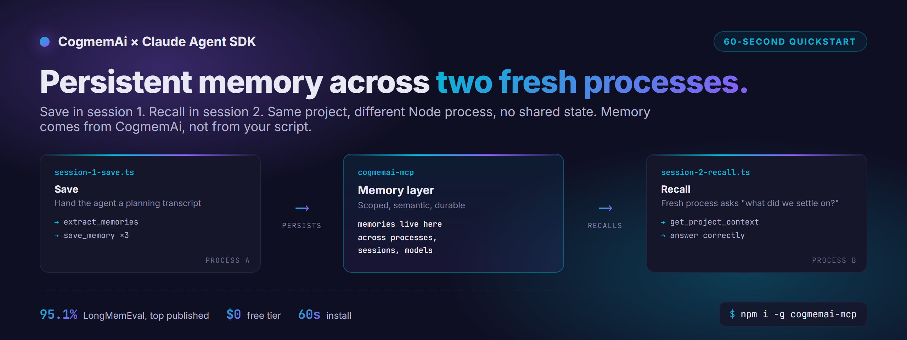

# CogmemAi + Claude Agent SDK Quickstart



Persistent memory for the Claude Agent SDK in 60 seconds.

This repo is the smallest possible working example of CogmemAi (the Smart Persistent Memory layer that scored **95.1% on LongMemEval**, the top published score in the field) wired into a Claude Agent SDK script. Run two scripts back-to-back and watch the agent remember across processes.

> **Why this repo exists.** Starting June 15, 2026, Anthropic gives Max 20x subscribers a $200/mo credit specifically for Claude Agent SDK and `claude -p` usage. Memory is the deepest unsolved pain in those workflows. This repo is the shortest path from "I have $200 to spend" to "my agent now remembers everything."

## What you get

- A working two-session demo: **save in session 1, recall in session 2**, no glue code
- The `mcpServers` block you copy into any Agent SDK project
- The exact tool calls the agent makes (and why)

## Requirements

- Node.js 20+
- An [Anthropic API key](https://console.anthropic.com/) or a Max 20x subscription with `claude -p` configured
- A free [CogmemAi API key](https://hifriendbot.com/developer/) (no card)

## Install

```bash
git clone https://github.com/hifriendbot/cogmemai-mcp-agent-sdk-quickstart
cd cogmemai-mcp-agent-sdk-quickstart
npm install

# install + register the CogmemAi MCP server (one time, global)
npm install -g cogmemai-mcp
npx cogmemai-mcp setup
```

The setup wizard prompts for your CogmemAi API key, writes the MCP config, and registers the autonomous-capture hooks that build memory as you work.

## Run the demo

Two-session demo: the first script saves a few facts; the second script (a fresh Node process) recalls them.

```bash
# Session 1: tell the agent some things, ask it to remember
npx tsx src/session-1-save.ts

# Session 2: fresh process, fresh context, ask the agent what it knows
npx tsx src/session-2-recall.ts
```

Expected output of session 2:

```
Pulling project context...
Found 3 memories.

The agent says:
"Yesterday we settled on three constraints for the orders service:
 1. GraphQL only, no REST endpoints
 2. Mobile latency budget under 200 ms per request
 3. PostgreSQL for the read store, Redis for hot keys

You also mentioned you always use Bun, never npm, across every project."
```

The two scripts share nothing in memory at the OS level. The agent's continuity comes entirely from CogmemAi.

## What the code looks like

The interesting line is the `mcpServers` block. That's the entire integration:

```ts
import { query } from "@anthropic-ai/claude-agent-sdk";

const result = await query({
  prompt: "Pick up where we left off on the orders service.",
  mcpServers: {
    cogmemai: { command: "cogmemai-mcp" },
  },
});
```

The agent now has access to every CogmemAi tool: `save_memory`, `recall_memories`, `extract_memories`, `get_project_context`, `save_task`, `set_reminder`, `link_memories`, `consolidate_memories`, plus the others. It calls them when the conversation calls for it.

See [`src/session-1-save.ts`](./src/session-1-save.ts) and [`src/session-2-recall.ts`](./src/session-2-recall.ts) for the full runnable scripts.

## Why memory matters in the Agent SDK

Every Agent SDK or `claude -p` workflow has the same failure modes:

- **Context compaction** wipes mid-session detail and reduces it to a fuzzy paragraph
- **Process boundaries** kill in-memory state at the end of every script
- **Model handoffs** (Opus to Haiku, Haiku to Sonnet) reset everything
- **Multi-agent flows** force every agent to relearn the same project context

CogmemAi survives all four. Memory is scoped per project, optionally global, optionally team-shared. Recall is semantic + recency + importance ranked, not naive keyword search.

## Six skills, all open

The CogmemAi MCP server ships six discoverable skills (visible on the [Skills Marketplace](https://skillsmp.com)). Each teaches the agent a specific memory workflow:

| Skill | When it fires |
|---|---|
| `cogmemai-memory` | Reference for memory management overall |
| `session-start` | First message of every session, before responding |
| `save-context` | "Save context", "checkpoint", or compaction risk |
| `remember-this` | "Remember this", "don't forget", explicit preferences |
| `save-bugfix` | After any verified bug fix |
| `search-before-debugging` | Before debugging any new error |

Source for all six is in the [main cogmemai-mcp repo](https://github.com/hifriendbot/cogmemai-mcp/tree/main/skill).

## You're using 4 of 35 tools

This quickstart calls about four of the tools the CogmemAi MCP server exposes (`extract_memories`, `save_memory`, `get_project_context`, and a recall path). The full server ships with **35 tools** and they all install with the same `npm install -g cogmemai-mcp` command. You don't need a different install or a paid plan to use them; they're all available on the free tier, capped only by usage limits.

A non-exhaustive tour of what's in the box once the basic demo clicks for you:

| Category | Tools | What they unlock |
|---|---|---|
| Recall | `recall_memories`, `get_project_context`, `list_memories`, `list_tags` | Semantic + recency + importance ranked retrieval, scoped per project or global |
| Lifecycle | `update_memory`, `delete_memory`, `bulk_update`, `bulk_delete`, `get_memory_versions` | Versioned edits, mass cleanup, history-aware updates |
| Knowledge graph | `link_memories`, `get_memory_links`, `consolidate_memories`, `promote_memory` | Connect related facts, merge duplicates, lift project-scope memory to global |
| Tasks + reminders | `save_task`, `update_task`, `get_tasks`, `set_reminder` | Cross-session task tracking and scheduled nudges |
| Skills + rules | `save_rule`, `list_rules`, `delete_rule`, `generate_skills`, `extract_principles` | Codify standing user rules; auto-generate skills from accumulated memory |
| Analytics + health | `get_analytics`, `get_usage`, `get_stale_memories`, `feedback_memory`, `preflight` | Memory health scores, usage trends, surface stale content for review |
| Bulk I/O | `import_memories`, `export_memories`, `ingest_document` | Backup, migrate, or seed from PDFs/markdown/transcripts |
| Session + context | `save_session_summary`, `save_correction`, `get_file_changes` | Wrap-up summaries, wrong→right pattern capture, file-level activity |

The two skills that drive the most team value are paired: `save-bugfix` (capture symptom + root cause + fix after every resolved bug) and `search-before-debugging` (recall existing fixes before debugging from scratch). Same bug, debugged once. See the [`skill/`](https://github.com/hifriendbot/cogmemai-mcp/tree/main/skill) directory in the main repo.

## Free vs Pro

Free tier is enough for a single developer doing personal work. Pro tier is what teams move to when memory becomes operational.

| | Free | Pro |
|---|---|---|
| Memories | 500 / month | Higher limits |
| Extractions | 500 / month | Higher limits |
| Projects | 5 | Unlimited |
| Card required | No | Yes |
| Team-shared memory across members | — | ✓ |
| Analytics + health-score dashboards | basic | full |
| Cross-platform recall (MCP, REST, Chrome extension all sharing one memory pool) | ✓ | ✓ |
| On-prem dedicated deployment | — | ✓ (defense / regulated) |

[See current pricing](https://hifriendbot.com/pricing/) · [Get a free API key](https://hifriendbot.com/developer/) · [Talk to us about teams or on-prem](https://hifriendbot.com/contact/)

## Receipts

| | |
|---|---|
| LongMemEval | **95.1%** (Apr 19, 2026, top published) |
| LoCoMo | **91%** (Apr 2, 2026, above human baseline) |
| Methodology | Answering model: Claude Opus 4.7. Judge: GPT-4o. 102 questions, 97 correct. |

Free tier covers 500 memories + 500 extractions per month across 5 projects. No card. Get a key at [hifriendbot.com/developer](https://hifriendbot.com/developer/).

## License

MIT. Fork it, rip it apart, build on it.

## Star this repo

If this saved you time, star the [main cogmemai-mcp repo](https://github.com/hifriendbot/cogmemai-mcp). Stars feed the Skills Marketplace ranker so more developers find these workflows.

---

Built by [HiFriendbot](https://hifriendbot.com). CogmemAi is the Smart Persistent Memory layer for Ai agents.
